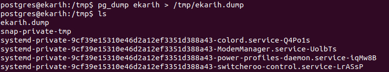
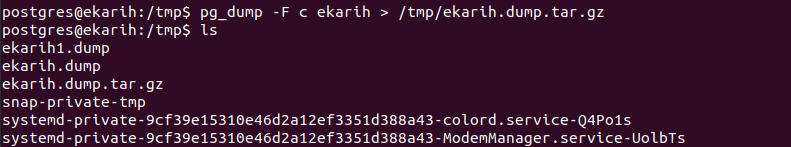
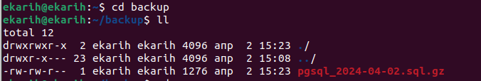

## Домашнее задание к занятию "Резервное копирование баз данных" - Карих Елена
---
### Задание 1 Резервное копирование

Кейс
Финансовая компания решила увеличить надёжность работы баз данных и их резервного копирования.
Необходимо описать, какие варианты резервного копирования подходят в случаях:
1.1. Необходимо восстанавливать данные в полном объёме за предыдущий день.
1.2. Необходимо восстанавливать данные за час до предполагаемой поломки.
1.3.* Возможен ли кейс, когда при поломке базы происходило моментальное переключение на работающую или починенную базу данных.

Приведите ответ в свободной форме.

### Решение 1

1.1. Необходимо выполнять полное резервное копирование (достаточно один раз в неделю). А раз в день делать  дифференциальный бэкап. Для восстановления данных в полном объеме за заданный день нужно будет восстановить полный бэкап на начало недели и на него накатить тот дифференциальный бэкап за тот день, за который нужно восстановить данные;
1.2. Здесь лучше выполнять полное резервирование каждый день, и дополнительно осуществлять инкрементный бэкап один раз в час. Для восстановления данных: надо будет восстановить данные на начало дня полным бэкапом, а далее поочередно накатывать инкрементные бэкапы до требуемого часа (процедура восстановления не будет такой долгой);
1.3.* Данный кейс возможен в рамках репликации а не резервного копирования. При повреждении мастера слейв, хранящий последние реплицированные данные, переводится в режим мастера и подхватывает нагрузку.

---
### Задание 2 PostgreSQL

2.1. С помощью официальной документации приведите пример команды резервирования данных и восстановления БД (pgdump/pgrestore).
2.1.* Возможно ли автоматизировать этот процесс? Если да, то как?
Приведите ответ в свободной форме.

### Решение 2

2.1. Создание резервной копии: 

```
pg_dump db-name > db-name.dump.sql
```



Выгрузка базы в архивный файл (для экономии места):
```
pg_dump -F c db-name > db-name.dump.tar.gz
```


Удалить базу:
```
dropdb db-name
```

Восстанавливаем базу из архивного файла:
```
pg_restore -Cd db-name db-name.dump
```

2.2.* Да, можно сделать скрипт и настроить его запуск через планировщика (например cron):

```
#!/bin/sh
pg_dump -U ekarih -w ekarih > /home/ekarih/backup/pgsql_$(date "+%Y-%m-%d").sql.gz
```
```
crontab -e

0 1 * * *     /home/ekarih/psql/scrin.psql.dump.sh
```
 

---
### Задание 3 MySQL

3.1. С помощью официальной документации приведите пример команды инкрементного резервного копирования базы данных MySQL.
3.2.* В каких случаях использование реплики будет давать преимущество по сравнению с обычным резервным копированием?
Приведите ответ в свободной форме.

### Решение 3

3.1. Команда:
```
mysqldump --flush-logs --delete-master-logs --single-transaction --all-databases | gzip > /var/backups/mysql/$(date +%d-%m-%Y_%H-%M-%S)-inc.gz
```

3.2.* Использование реплики будет приемущественнее если есть проблемы с производительностью и доступностью основоного сервера.

---
